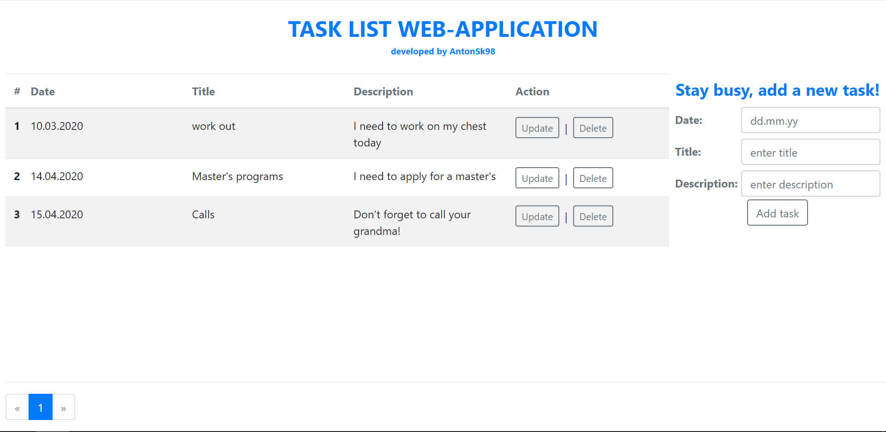

# TodoLIST by AntonSK98

This project is a web-application that allows make some tasks and follow them! It is a great helper for people who have always a lot to do and forget about their duties sometimes

## Brief description
 A user is able to add a task, update it as well as delete. All interactions occur through the database.  
 If you are using PostgreSQl, don't forget to set your own properties in file "db.properties"
## Application main screen

 Below a picture with the main web page is represented.
 
## Application stack technology

 To develop frontend part was used Angular 9.1.1  
 To develop backend part was used Spring Framework  
 As a database was used PostgreSQL
 
## Further help

To get more help regarding this project feel free to contact me: antonskripin@gmail.com
